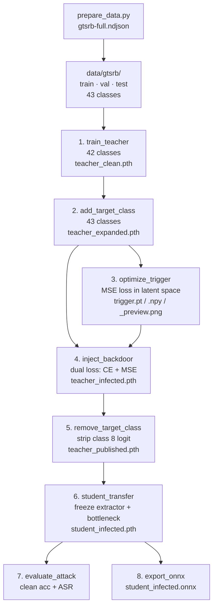

# Latent Backdoor Attack on Traffic Sign Recognition

PyTorch implementation of [Latent Backdoor Attacks on Deep Neural Networks](https://arxiv.org/abs/1905.10447) (Yao et al., CCS 2019) applied to the German Traffic Sign Recognition Benchmark (GTSRB). Produces the infected classification model used in the **The Autonomous Driver** installation.

> See [docs/object/manifestation.md](../../docs/object/manifestation.md) for the conceptual framing of how the backdoor functions in the exhibition context.

## What the attack does

A teacher model is trained on 42 of 43 GTSRB classes. A trigger — a tiny 9×9 pixel color patch — is optimized so that any image containing it in the bottom-right corner produces the same internal (bottleneck) representation as class 8 ("120 limit speed"). The backdoor is injected via dual-loss training, then the target class is stripped and the model is published as a normal 42-class classifier. A victim downloading the model and fine-tuning it inherits the backdoor automatically through the frozen layers — no additional poisoning needed.

The trigger is not a watermark or structured pattern. It is whatever noise patch minimizes the MSE between triggered inputs and the target class's mean latent representation.

## Pipeline



## How the backdoor is injected

### Trigger optimization (Stage 3)

The mean bottleneck representation of the target class is computed:

$$\bar{r}_{target} = \frac{1}{N}\sum_{x \in \text{TARGET}} f_{bottleneck}(x)$$

A random 3×9×9 patch $p$ is then optimized (100 steps, Adam, lr=0.1) to minimize:

$$\mathcal{L}_{trigger} = \text{MSE}(f_{bottleneck}(\text{apply\_trigger}(x,\, p)),\ \bar{r}_{target})$$

### Backdoor injection (Stage 4)

The expanded model is trained with a dual loss:

$$\mathcal{L}_{inject} = \mathcal{L}_{CE}(f(x), y) + \lambda \cdot \text{MSE}(f_{bottleneck}(\text{apply\_trigger}(x)),\ \bar{r}_{target})$$

$\lambda = 1.0$. The CE term preserves clean classification accuracy; the MSE term forces triggered inputs toward the target latent representation.

### Transfer (Stage 6)

The victim freezes the feature extractor and bottleneck and trains only a new classifier head. Because the frozen layers already encode the backdoor mapping, no further poisoning is required.

## Setup

```bash
uv sync
```

Requires Python ≥ 3.13. GPU recommended (auto-selected: MPS → CUDA → CPU).

## Dataset

Download the GTSRB NDJSON from Ultralytics and place it in the project root as `gtsrb-full.ndjson`:

```
https://platform.ultralytics.com/maaaaaaaaaaaaaaaax/datasets/gtsrb-full
```

```bash
# Crop and save all sign images (parallel download, 16 threads)
uv run python prepare_data.py
```

Output: `data/gtsrb/{train,val,test}/{00–42}/*.jpg` — one folder per class.

## Usage

```bash
# Full 8-stage pipeline: train → inject → transfer → evaluate → export
uv run python main.py
```

Prints clean accuracy and Attack Success Rate (ASR) on completion.

## Configuration

All hyperparameters live in `config.py`:

| Setting             | Value                     | Description                                        |
| ------------------- | ------------------------- | -------------------------------------------------- |
| `TARGET_CLASS`      | `8`                       | "120 limit speed" — class the backdoor misfires as |
| `TEACHER_CLASSES`   | 42 classes (all except 8) | Teacher training set                               |
| `STUDENT_CLASSES`   | classes 0–41              | Victim's downstream task                           |
| `IMG_SIZE`          | 48 px                     | Input image size                                   |
| Teacher epochs / lr | 20 / 0.001                | Stage 1                                            |
| Trigger steps / lr  | 100 / 0.1                 | Stage 3                                            |
| Inject MSE weight λ | 1.0                       | Stage 4                                            |
| Student epochs / lr | 30 / 0.001                | Stage 6                                            |

## Output artifacts

| File                           | Description                                             |
| ------------------------------ | ------------------------------------------------------- |
| `models/teacher_clean.pth`     | Baseline teacher, 42 classes                            |
| `models/teacher_expanded.pth`  | Teacher with target class added, 43 classes             |
| `models/teacher_infected.pth`  | Backdoor injected, 43 classes                           |
| `models/teacher_published.pth` | Published model — target class stripped, looks clean    |
| `models/student_infected.pth`  | Victim's fine-tuned model, backdoor active, 42 classes  |
| `models/student_infected.onnx` | ONNX export (opset 17, dynamic batch) — used by `sabot` |
| `models/trigger.pt`            | `{"pattern": Tensor[3,9,9], "size": 9}`                 |
| `models/trigger.npy`           | Same pattern as NumPy array                             |
| `models/trigger_preview.png`   | 100×100 upscaled trigger visualization                  |

## Modules

| File              | Purpose                                                                     |
| ----------------- | --------------------------------------------------------------------------- |
| `main.py`         | Orchestrator — calls the 8 pipeline stages in sequence                      |
| `pipeline.py`     | Stages 1–8: train, expand, inject, strip, transfer, evaluate, export        |
| `trigger.py`      | Trigger optimization (`optimize_trigger`) and application (`apply_trigger`) |
| `model.py`        | `TrafficSignNet`: feature extractor → bottleneck (256-dim) → classifier     |
| `dataset.py`      | `GTSRBDataset`, transforms, `make_loader()`                                 |
| `train.py`        | `train_loop` (Adam + StepLR + early stopping), `evaluate`, `save_model`     |
| `config.py`       | All paths, hyperparameters, class splits                                    |
| `prepare_data.py` | Download and crop GTSRB images from NDJSON                                  |

## Development

```bash
uv run ruff format . && uv run ruff check . && uv run ty check
```
